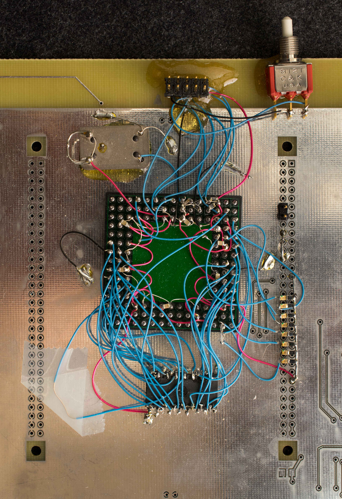
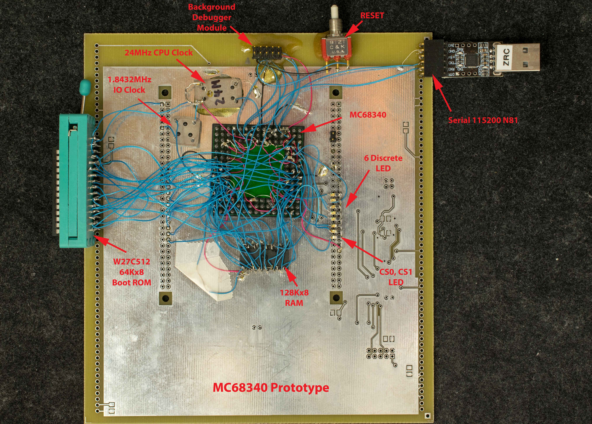

# SBC68340 Prototype

68340 Prototype board created around 2004

### Introduction
MC68340 is a member of CPU32 family which are microcontrollers based on MC68000 core. I bought several tubes of surplus MC68340 20+ years ago and built up a prototype board to check it out and then forgot about it. 
My interest is rekindled by recent discussion about [mc68340-cpu32-looking-for-the-answers](https://forum.vcfed.org/index.php?threads/mc68340-cpu32-looking-for-the-answers.1251868/) and managed to find the 68340 prototype board. 
I've made further progress with the prototype adding a boot ROM, IO clock and serial port interface; I've ported a simple monitor and ported TUTOR v1.3 to the prototype board; and I've designed a pc board version. Before putting away the prototype board (like the last scene of “Raider of Lost Ark”), I'm documenting what I did with this prototype.

[Schematic](proto68340_added_bootROM_scm.pdf)

[340Bug and Tutor v1.3](proto68340_software_340bug_and_tutor.zip) in boot flash
