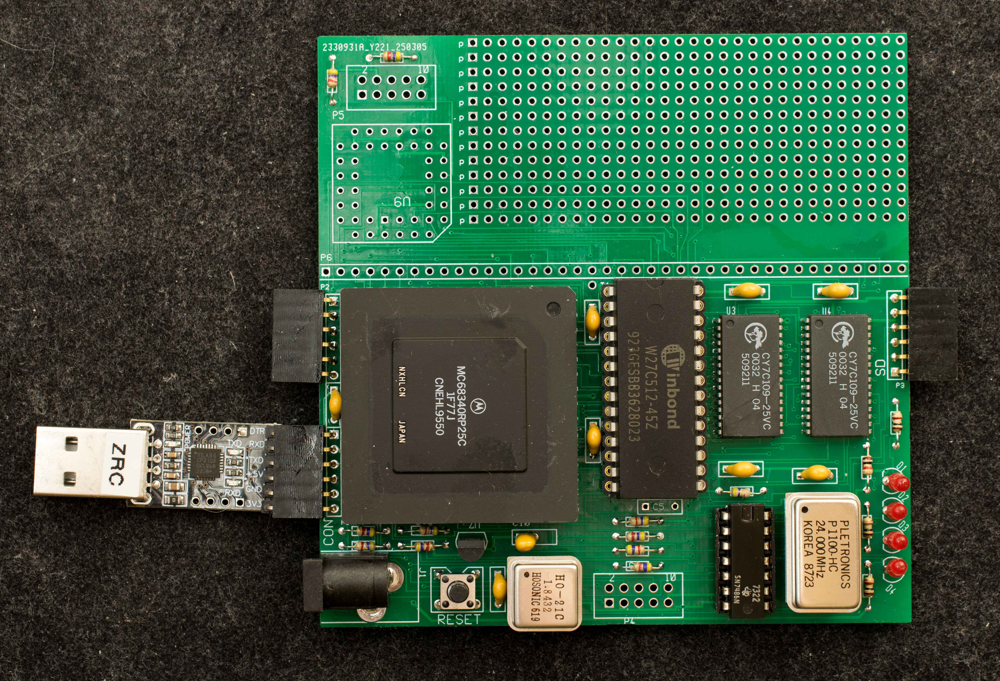

# SBC68340
SBC68340 is a single board computer based on MC68340.

There is a [prototype](Prototype) version of SBC68340 and a [rev0 pc board](SBC68340Rev0) version

Discussion about SBC68340 can be found [here](https://forum.vcfed.org/index.php?threads/a-mc68340-homebrew.1252181/)

Prototype SBC68340

SBC68340 PCB rev0
